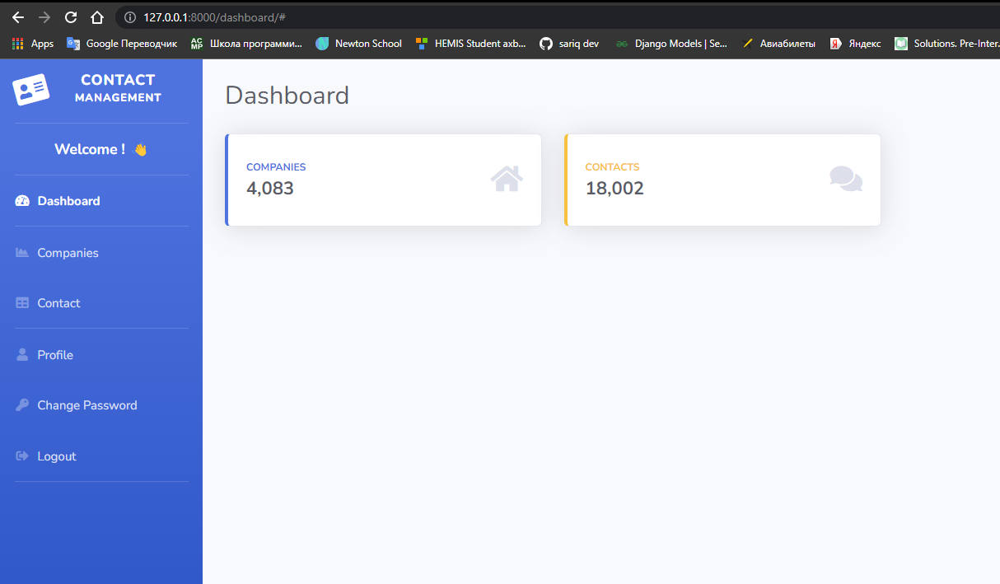

# Django CRM Project - Contact Management Project

### Setup

1. Create a folder and put all the files inside it.
2. Create a virtual environtment - `python -m venv venv`
3. Activate VirtualENV - ubuntu : `source venv/bin/activate` || windows : `. .\venv\Scripts\activate`
4. Run requirements.txt - `pip install -r requirements.txt`
5. Run the Application - `python manage.py runserver`
6. Migrate

